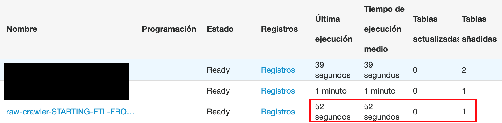
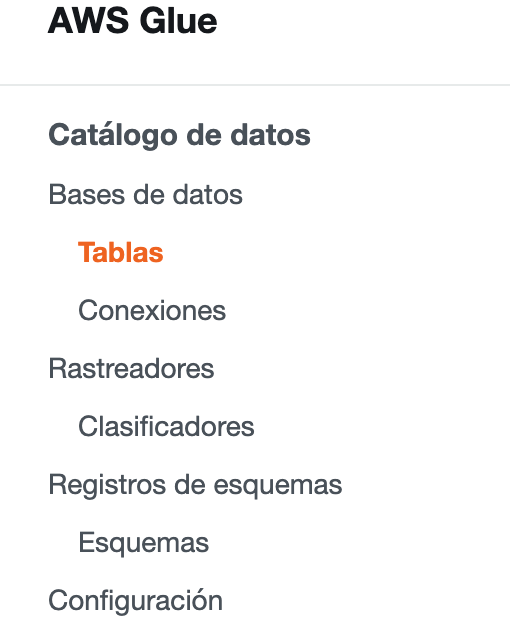
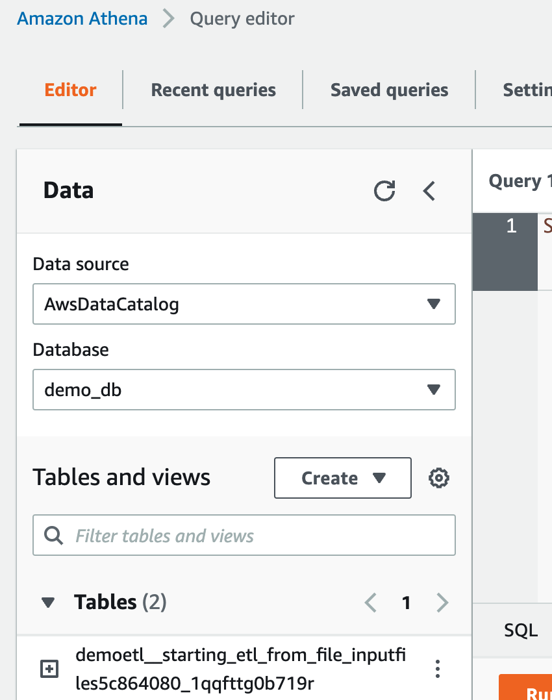
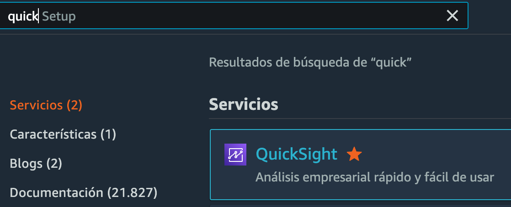
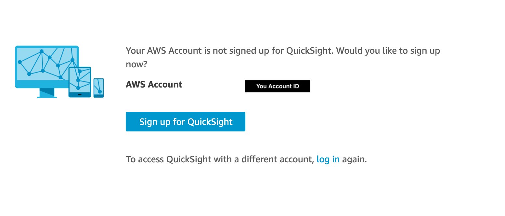
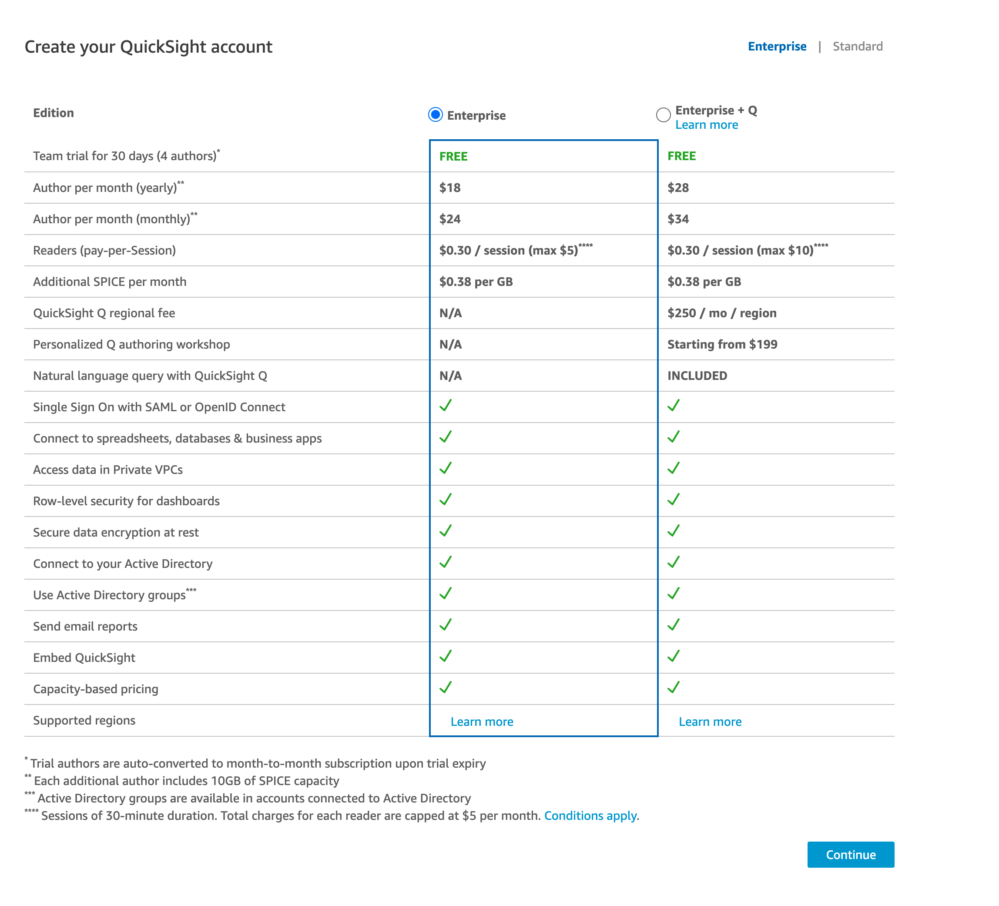
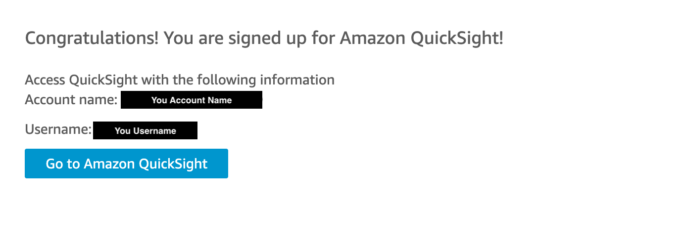
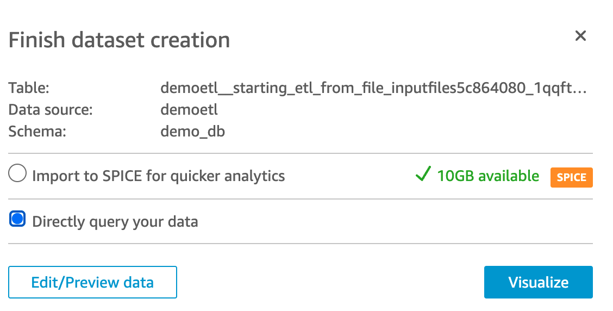
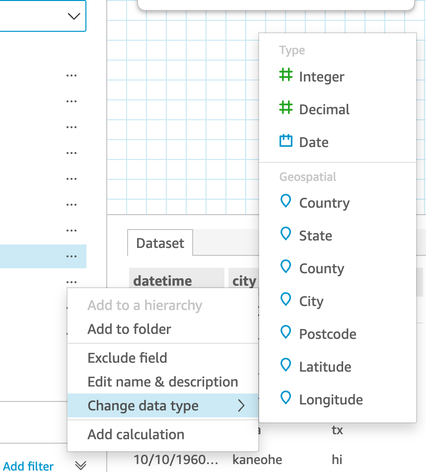
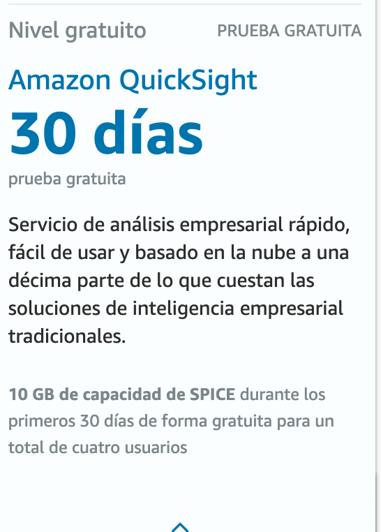

# Primeros pasos con Data Analytics en AWS


 🇻🇪🇨🇱 [Dev.to](https://dev.to/elizabethfuentes12) [Linkedin](https://www.linkedin.com/in/lizfue/) [GitHub](https://github.com/elizabethfuentes12/) [Twitter](https://twitter.com/elizabethfue12)

---

## Introducción 👩🏻‍💻👋

**Data Analytics** 📉 es un concepto muy utilizado hoy en día, es casi un pecado no saber que **Data Analytics** es el proceso de recopilar, procesar y analizar datos para usarlos tomar decisiones en base a ellos.

**Data Analytics** te permite combinar datos para crear soluciones que ayuden a las empresas a decidir donde y cuando lanzar nuevos productos, cuando ofrecer descuentos, analizar gastos y buscar ahorros, es posible crear modelos de machine learning para realizar mejoras como customer personalization, detención de fraude, alertas en tiempo real, comportamiento de tus usuarios y crear modelos que mejoren financias y predigan la forma de hacer mejores inversiones. 

El **Data Analytics** es importante para las empresas sin importar su tamaño, sin ello las decisiones serian tomadas por intuición o suerte. 

La data se puede generar de varias formas, recopilando clics de una página web, través de una API, encuestas, bases de datos locales, si sabés donde mirar prácticamente todo es data. El desafío está en almacenarla en un mismo lugar, crear Data Lakes, para poder hacer cruces y análisis con ella, hacer uso de ella. 

En este blog te voy a mostrar cómo crear un pequeño pipeline de **Data Analytics**, donde se deja un archivo en un storage y de ahí es procesado para crear una tabla de la cual se alimentá un dahsboard de Business Inteligence. 

Y.. Lo podrás desplegar listo para usar con un par de comandos usando [CDK](https://aws.amazon.com/es/cdk/?nc1=h_ls) 🚀 👩🏻‍🚀.

---

## La Solución 📉 🤔 ⚙️


1. Se deja el archivo en el Bucket de [Amazon S3](https://aws.amazon.com/es/s3/), lo cual activa la [AWS Lambda](https://aws.amazon.com/es/lambda/) que inicia el [AWS Glue Crawler](https://docs.aws.amazon.com/glue/latest/dg/add-crawler.html).
2. El [AWS Glue Crawler](https://docs.aws.amazon.com/glue/latest/dg/add-crawler.html) explora el nuevo archivo para identificar el esquema (columas), tipo de datos que lo conforman (int, string..etc).
3. Una vez finalizada la exploración de [AWS Glue Crawler](https://docs.aws.amazon.com/glue/latest/dg/add-crawler.html) este crea/actualiza la tabla asociada a la data descubierta en el [AWS Glue Data Catalog](https://docs.aws.amazon.com/glue/latest/dg/populate-data-catalog.html), el cual a su vez permite que se acceda a la tabla utilizando [Amazon Athena](https://aws.amazon.com/es/athena/). 
4. Una vez creado el el DashBoard de [Amazon QuickSight](https://aws.amazon.com/es/quicksight/) desde query a data en Athena queda listo para hacer Data Analytics.  

---

## Despliegue 🚀 👩🏻‍🚀


**Para crear la aplicación en tu cuenta AWS debes seguir los siguientes pasos:**

### 1. Instalar CDK

Para realizar el despliegue de los recursos, debes instalar y configurar la cli (command line interface) de CDK, en este caso estamos utilizando CDK con Python.

[Instalación y configuración de CDK](https://docs.aws.amazon.com/cdk/latest/guide/getting_started.html)

[Documentación CDK para Python](https://docs.aws.amazon.com/cdk/api/latest/python/index.html)


### 2. Clonamos el repo y vamos la carpeta de nuestro proyecto. 

```bash
git clone https://github.com/elizabethfuentes12/first-steps-with-analytics-in-aws
cd first-steps-analytics
```

### 3. Creamos e iniciamos el ambiente virtual

```bash
python3 -m venv .venv
source .venv/bin/activate
```

Este ambiente virtual (venv) nos permite aislar las versiones del python que vamos a utilizar como también de librerías asociadas. Con esto podemos tener varios proyectos con distintas configuraciones.


### 4. Instalamos los requerimientos para el ambiente de python 

Para que el ambiente pueda desplegarse, debemos agregar todas las librerías CDK necesarias en el archivo  [requirements.txt](https://github.com/elizabethfuentes12/first-steps-with-analytics-in-aws/first-steps-analytics/requirements.txt)


```zsh
pip install -r requirements.txt
```

### 5. Desplegando la aplicación 🚚

Si deseas desplegar tu solución en una región especifica debes modificar el archivo [app.py](https://github.com/elizabethfuentes12/first-steps-with-analytics-in-aws/first-steps-analytics/app.py) la siguiente linea: 

```zsh
env=cdk.Environment(region='us-east-1')
```

Antes de desplegar debemos asegurarnos que el código este sin errores, eso lo hacemos con el siguiente comando donde se genera un template de cloudformation con nuestra definición de recursos en python.

```bash
cdk synth
```

Si hay algún error en tu código este comando te indicara cual es con su ubicación.  

En el caso de estar cargando una nueva versión de la aplicación puedes revisar que es lo nuevo con el siguiente comando: 

```
cdk diff
```

Procedemos a desplegar la aplicación: 

```
cdk deploy
```

### 6. Tips Para el despliegue 👩🏻‍💻


El despliegue lo utiliza utilizando las credenciales por defecto de AWS, si desea usar un profile específico agregue --profile <nombre> al comando deploy:

```
cdk deploy --profile mi-profile-custom
```

o simplemente exporte en una variable de entorno

```
export AWS_PROFILE=mi-profile-custom
cdk deploy
```


### 7. La aplicación 👩🏻‍💻

Este CDK creará los siguientes elementos:
- Bucket de S3 con el nombre **starting-etl-from-file-inputfilesXXXXXXXXXX**
- Lambda Function con el nombre **process_new_file-STARTING-ETL-FROM-FILE**, el Glue Crawler se inicia con las siguientes lineas de comando dentro de la Lambda.

``` python
    # Comenzamos la ejecución del crawler
    response = boto3.client('glue').start_crawler(
        Name= os.environ.get('CRAWLER_NAME')
    )
```

Entra acá [Boto3 para glue](https://boto3.amazonaws.com/v1/documentation/api/latest/reference/services/glue.html#Glue.Client.start_crawler) si quieres aprender más sobre estas líneas. 

- Una base de datos en Glue con el nombre **demo_db**
- Glue Crawler con el nombre **raw-crawler-STARTING-ETL-FROM-FILE**, al correr el crawler se creara una tabla con prefijo **demoetl_**.

Una vez verificado que los elementos se crearon de forma correcta, procede a cargar el archivo en el Bucket de S3 creado, este archivo debe tener formato .csv, .txt o .json, y todos los archivos que cargues después deben tener el mismo formato y esquema.

Cuando el Crawler vuelva a estado **Ready** significa que la tabla ya fue creada en la base de datos **demo_db**. 

Puedes ver la cantidad de Tablas creadas/actualizadas y además el tiempo de duración del Crawler. 



En el Catálogo de AWS Glue puedes acceder a la base de dato y a las tablas creadas:



Puedes explotar la tabla con Athena:




### 8. Crear un Dashboard en [Amazon QuickSight](https://aws.amazon.com/es/quicksight/) 📉🚀🖥️

Documentación oficial de [Amazon QuickSight](https://docs.aws.amazon.com/es_es/quicksight/latest/user/signing-up.html)



Si nunca has usado Amazon QuickSight debes crear una cuenta. 

1. Al ingresar verás una pantalla como esta, debes presionar **"Sign up for QuickSight"**



2. A continuación debes escoger el tipo de cuenta que quieres crear y seguir los pasos, recuerda darle permiso a QuickSight para acceder a la data, para más información [aca](https://aws.amazon.com/es/quicksight/pricing/).



3. Listo!, ingresa a tu cuenta. 


4. Una vez dentro de [Amazon QuickSight](https://aws.amazon.com/es/quicksight/) vamos a [Datasets](https://us-east-1.quicksight.aws.amazon.com/sn/start/data-sets) --> New dataSet y dentro del mar de opciones seleccionamos Athena, sigue los pasos y cuando llegues a esta ventana selecciona la opción **Directly query your data**, [**SPICE**](https://docs.aws.amazon.com/quicksight/latest/user/spice.html) es un almacenamiento en QuickSight que entrega mayor rendimiento a tu Dashboard, pero la data debe ser actualizada no se actualiza automáticamente.  



4. En el paso anterior puedes editar el dataset con Edit/Preview data, una vez dentro puedes seleccionar los **...** de las columnas y ver las opciones de edición, presiona **Publish & Visualizalise** para avanzar. 



5. Crea tu Dashboard para empezar a hacer Data Analytics. 

AWS tiene material gratuito que te puede ayudar a convertite en un usario experto de [Amazon QuickSight](https://aws.amazon.com/es/quicksight/): 

[AWS WorkShops](https://workshops.aws/card/quicksight)

[AWS SkillBuilder](https://explore.skillbuilder.aws/learn/global-search/quicksight ) - Puedes registrarte con tu correo personal. 

Aprovecha la capa gratuita de [QuickSight](https://aws.amazon.com/es/quicksight/) para que metas las manos. 



---

### 8. Eliminar el stack de la aplicación 🚫

Esta aplicación no elimina el bucket si contiene videos, por lo que primero debes vaciar el bucket y luego proceder a destruir el stak. 


Para eliminar el stack lo puedes hacer via comando:

```
cdk destroy
```

ó via consola cloudformation, seleccione el stack (mismo nombre del proyecto cdk) y lo borra.

## ¡¡Happy developing 😁!!


---


## Adicional 🤔 ⚙️ 🧰


En este adicional, en vez de dejar un archivo en [Amazon S3](https://aws.amazon.com/es/s3/) se deja en una carpeta de OneDrive. 

1. Se deja el archivo en la carpeta de OneDrive, la cual esta siendo escuchada con un Webhook en [Amazon API Gateway](https://aws.amazon.com/es/api-gateway/). 
2. [Amazon API Gateway](https://aws.amazon.com/es/api-gateway/) activa una [AWS Lambda](https://aws.amazon.com/es/lambda/) encargada de extraer la data de OneDrive y copiarla en S3, para que esto sea posible la Lambda debe obtener el Token y refresh_token desde [AWS Secrets Manager](https://aws.amazon.com/es/secrets-manager/). 
4. Retomamos el paso 1 de la arquitectura de la solucion anterior. 


🔜 Pronto en una próxima publicación.. 

___

## Servicios involucrados en la solución son

### Amazon S3 (Simple Storage Service):
[Amazon S3](https://aws.amazon.com/es/s3/) es un servicio de computo sin servidor que le permite ejecutar código sin aprovisionar ni administrar servidores.

### AWS Lamdba: 
[AWS Lambda](https://aws.amazon.com/es/lambda/) es un servicio de computo sin servidor que le permite ejecutar código sin aprovisionar ni administrar servidores. 

### AWS Glue Crawler: 
[AWS Glue Crawler](https://docs.aws.amazon.com/glue/latest/dg/add-crawler.html) Es un servicio de AWS, que te permite desubrir data, reconoce su esquema o columnas, el tipos de dato, arma un catalogo de glue. Se puede ejecutar a demanda o agendados. 

### AWS Glue Data Catalog: 
[AWS Glue Data Catalog](https://docs.aws.amazon.com/glue/latest/dg/populate-data-catalog.html) contiene referencias a los datos, es un índice de la ubicación,al esquema y al tiempo de creación. La información en los catalogos se almacena como tablas de metadatos, donde cada tabla hace referencia a un único almacen de datos. 

### Amazon Athena: 
[Amazon Athena](https://aws.amazon.com/es/athena/) es un servicio de consultas interactivo que facilita el análisis de datos en Amazon S3 con SQL estándar. Athena no tiene servidor, de manera que no es necesario administrar infraestructura y solo paga por las consultas que ejecuta.

### Amazon QuickSight: 
[Amazon QuickSight](https://aws.amazon.com/es/quicksight/) es un servicio de análisis empresarial muy rápido, fácil de utilizar y administrado en la nube que facilita a todos los empleados de una organización la compilación de visualizaciones, la realización de análisis ad-hoc y la obtención rápida de información empresarial a partir de sus datos en cualquier momento y en cualquier dispositivo.

### Amazon API Gateway: 
[Amazon API Gateway](https://aws.amazon.com/es/api-gateway/) es un servicio completamente administrado que facilita a los desarrolladores la creación, la publicación, el mantenimiento, el monitoreo y la protección de API a cualquier escala. Las API actúan como la "puerta de entrada" para que las aplicaciones accedan a los datos, la lógica empresarial o la funcionalidad de sus servicios de backend. 

### AWS Secrets Manager: 
[AWS Secrets Manager](https://aws.amazon.com/es/secrets-manager/) le ayuda a proteger los datos confidenciales necesarios para acceder a sus aplicaciones, servicios y recursos de TI. El servicio le permite alternar, administrar y recuperar fácilmente credenciales de bases de datos, claves de API y otros datos confidenciales durante su ciclo de vida. Los usuarios y las aplicaciones recuperan datos confidenciales con una llamada a las API de Secrets Manager, lo que elimina la necesidad de codificar información confidencial en texto sin formato


### CDK (Cloud Development Kit): 
El kit de desarrollo de la nube de AWS (AWS CDK) es un framework de código abierto que sirve para definir los recursos destinados a aplicaciones en la nube mediante lenguajes de programación conocidos.

Una vez lo conozcas... no vas a querer desarrollar aplicaciones en AWS de otra forma ;)

Conoce más acá: [CDK](https://aws.amazon.com/es/cdk/?nc1=h_ls)


---

## ¡Gracias!

Te dejo mis redes para que me sigas: 

[Dev.to](https://dev.to/elizabethfuentes12)

[Linkedin](https://www.linkedin.com/in/lizfue/)

[GitHub](https://github.com/elizabethfuentes12/)

[Twitter](https://twitter.com/elizabethfue12)

🇻🇪🇨🇱