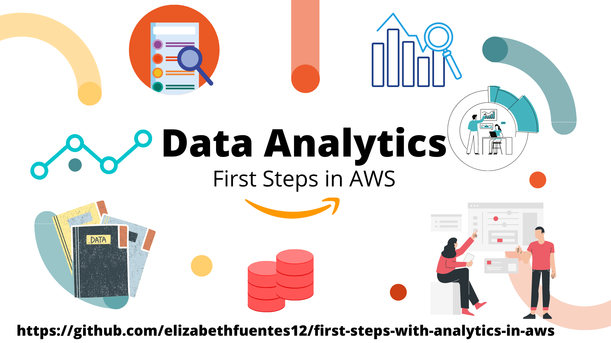

# Primeros pasos con analitica en AWS



---

## Introducción 👩🏻‍💻👋

**Data analytics** 📉 es un concepto muy utilizado hoy en dia, ya es casi un pecado no saber que **Data Analytics** es el proceso de compilar, procesar y analizar datos para que puedas usarlos en la tomar decisiones.

El análisis de datos es vital para que las empresas, no importa su tamaño. 

Porque con ello puedes combinar datos para crear soluciones que ayuden a las empresas a decidir donde y cuando lanzar nuevos productos, cuando ofrecer descuentos, analizar gastos y buscar ahorros. Aplicar machine learning para Customer personalization, detecion de fraude, alertas en tiempo real, comportamiento de tus usuarios y crear modelos que mejoren financias y predigan la forma de hacer mejores inversiones. 

Sin el análisis de los datos, las decisiones serian tomadas por intuición o suerte. 

El problema más importante que tiene data analytics es encontrar la data, capturarla, crearla y tenerla disponible para poder hacer uso de ella, en términos más generales armar un data lake. 

La data se puede generar de mi millones de formas, puedes a través de una API que este almacenando clicks o que este extrayendo data de alguna pagina web o servicio, puedes tener bases de datos on-premise. 

El desafio cuando tienes varias fuentes de datos es almacenarla toda junta para poder ingestarla, hacer crucer entre ellas, análisis en fin: hacer data analytics. 

En esta blog te voy a entregar las herramientas que te va a permitir darle solución a ese desafío, no solo vas a aprender como almacenar toda la data junta si no como crear una base de datos con ella y por supuesto crear un dashboard. 

Y.. Lo podrás desplegar listo para usar con un par de comandos usando [CDK](https://aws.amazon.com/es/cdk/?nc1=h_ls) 🚀 👩🏻‍🚀.

---

## La Solución 🤔 ⚙️


1. Se deja el archivo en el Bucket de [Amazon S3](https://aws.amazon.com/es/s3/), lo cual activa la [AWS Lambda](https://aws.amazon.com/es/lambda/) que gatilla el [AWS Glue Crawler](https://docs.aws.amazon.com/glue/latest/dg/add-crawler.html).
2. El [AWS Glue Crawler](https://docs.aws.amazon.com/glue/latest/dg/add-crawler.html) explora el nuevo archivo, y en paralelo gatilla un evento en EnventBridge que aciva la [AWS Lambda](https://aws.amazon.com/es/lambda/) encargada de actualizar a QuickSight una vez finalice la exploración. 
3. Una vez finalizada la exploracion de [AWS Glue Crawler](https://docs.aws.amazon.com/glue/latest/dg/add-crawler.html) este actualiza el [AWS Glue Data Catalog](https://docs.aws.amazon.com/glue/latest/dg/populate-data-catalog.html) , el cual a su vez actualiza la tabla en [Amazon Athena](https://aws.amazon.com/es/athena/) , el [Amazon EventBridge](https://aws.amazon.com/es/eventbridge/) informa a la [AWS Lambda](https://aws.amazon.com/es/lambda/) para que pueda actualizar el almacenamiento de Spice en [Amazon QuickSight](https://aws.amazon.com/es/quicksight/) desde la data en [Amazon Athena](https://aws.amazon.com/es/athena/). 
4. Queda el DashBoard de [Amazon QuickSight](https://aws.amazon.com/es/quicksight/) listo para hacer Data Analytics.  

---

## Despliegue 🚀 👩🏻‍🚀


**Para crear la aplicación debes seguir los siguientes pasos:**

### 1. Instalar CDK

Para realizar el despliegue de los recursos, debes instalar y configurar la cli (command line interface) de CDK, en este caso estamos utilizando CDK con Python.

[Instalación y configuración de CDK](https://docs.aws.amazon.com/cdk/latest/guide/getting_started.html)

[Documentación CDK para Python](https://docs.aws.amazon.com/cdk/api/latest/python/index.html)


### 2. Clonamos el repo y vamos la carpeta de nuestro proyecto. 

```bash
git clone https://github.com/elizabethfuentes12/first-steps-with-analytics-in-aws
cd AWS_ScanVideoS3Rekognition/ScanVideoS3Rekognition
```

### 3. Creamos e iniciamos el ambiente virtual

```bash
python3 -m venv .venv
source .venv/bin/activate
```

Este ambiente virtual (venv) nos permite aislar las versiones del python que vamos a utilizar como también de librerías asociadas. Con esto podemos tener varios proyectos con distintas configuraciones.

### 4. Explicación del código

En el GitHub esta el código listo para desplegar, a continuación una breve explicación:

Esta herramienta esta desplegada en *us-east-1*, si quieres cambiar la región debes hacerlo en [scan_video_s3_rekognition.py](https://github.com/elizabethfuentes12/AWS_ScanVideoS3Rekognition/blob/main/ScanVideoS3Rekognition/scan_video_s3_rekognition/scan_video_s3_rekognition_stack.py) 

```python
REGION_NAME = 'tu_region'
```
 
Antes de iniciar debes agregar una dirección de correo valida en [scan_video_s3_rekognition.py](https://github.com/elizabethfuentes12/AWS_ScanVideoS3Rekognition/blob/main/ScanVideoS3Rekognition/scan_video_s3_rekognition/scan_video_s3_rekognition_stack.py)  : 

```python
email="tucorreo@correo.com"
```

### 5. Instalamos los requerimientos para el ambiente de python 

Para que el ambiente pueda desplegarse, debemos agregar todas las librerías CDK necesarias en el archivo  [requirements.txt](https://github.com/elizabethfuentes12/AWS_ScanVideoS3Rekognition/blob/main/ScanVideoS3Rekognition/requirements.txt)


```zsh
pip install -r requirements.txt
```

### 6. Desplegando la aplicación

Previo al despliegue de la aplicación en AWS Cloud debemos asegurarnos que este sin errores para que no salten errores durante el despliegue, eso lo hacemos con el siguiente comando que genera un template de cloudformation con nuestra definición de recursos en python.

```bash
cdk synth
```

Si hay algún error en tu código este comando te indicara cual es con su ubicación.  

En el caso de estar cargando una nueva versión de la aplicación puedes revisar que es lo nuevo con el siguiente comando: 

```
cdk diff
```

Procedemos a desplegar la aplicación: 

```
cdk deploy
```

### 7. Tips Para el despliegue


El despliegue lo utiliza utilizando las credenciales por defecto de AWS, si desea usar un profile específico agregue --profile <nombre> al comando deploy:

```
cdk deploy --profile mi-profile-custom
```

o simplemente exporte en una variable de entorno

```
export AWS_PROFILE=mi-profile-custom
cdk deploy
```

---

### 8. La aplicación


---

### 9. Eliminar el stack de la aplicación

Esta aplicación no elimina el bucket si contiene videos, por lo que primero debes vaciar el bucket y luego proceder a destruir el stak. 


Para eliminar el stack lo puedes hacer via comando:

```
cdk destroy
```

ó via consola cloudformation, seleccione el stack (mismo nombre del proyecto cdk) y lo borra.

## ¡¡Happy developing 😁!!


---


## Adicional 🤔 ⚙️ 🧰


En este adicional, en vez de dejar un archivo en [Amazon S3](https://aws.amazon.com/es/s3/) se deja en una carpeta de OneDrive. 

1. Se deja el archivo en la carpeta de OneDrive, la cual esta siendo escuchada con un Webhook en [Amazon API Gateway](https://aws.amazon.com/es/api-gateway/). 
2. [Amazon API Gateway](https://aws.amazon.com/es/api-gateway/) activa una [AWS Lambda](https://aws.amazon.com/es/lambda/) encargada de extraer la data de OneDrive y copiarla en S3, para que esto sea posible la Lambda debe obtener el Token y refresh_token desde [AWS Secrets Manager](https://aws.amazon.com/es/secrets-manager/). 
4. Retomamos el paso 1 de la arquitectura de la solucion anterior. 


El código para lograr esta solucion se encontrara proximamente en los siguientes enlaces: 

Configuración Lambda Funtcion paso 2. 
Configuración API Gateway.
Condiguración Secrets Manager. 

___

## Servicios involucrados en la solución son

### Amazon S3 (Simple Storage Service):
[Amazon S3](https://aws.amazon.com/es/s3/) es un servicio de computo sin servidor que le permite ejecutar código sin aprovisionar ni administrar servidores.

### AWS Lamdba: 
[AWS Lambda](https://aws.amazon.com/es/lambda/) es un servicio de computo sin servidor que le permite ejecutar código sin aprovisionar ni administrar servidores. 

### AWS Glue Crawler: 
[AWS Glue Crawler](https://docs.aws.amazon.com/glue/latest/dg/add-crawler.html) Es un servicio de AWS, que te permite desubrir data, reconoce su esquema o columnas, el tipos de dato, arma un catalogo de glue. Se puede ejecutar a demanda o agendados. 

### AWS Glue Data Catalog: 
[AWS Glue Data Catalog](https://docs.aws.amazon.com/glue/latest/dg/populate-data-catalog.html) contiene referencias a los datos, es un índice de la ubicación,al esquema y al tiempo de creación. La información en los catalogos se almacena como tablas de metadatos, donde cada tabla hace referencia a un único almacen de datos. 

### Amazon Athena: 
[Amazon Athena](https://aws.amazon.com/es/athena/) es un servicio de consultas interactivo que facilita el análisis de datos en Amazon S3 con SQL estándar. Athena no tiene servidor, de manera que no es necesario administrar infraestructura y solo paga por las consultas que ejecuta.

### Amazon EventBridge: 
[Amazon EventBridge](https://aws.amazon.com/es/eventbridge/) es un bus de eventos sin servidor que facilita la creación de aplicaciones basadas en eventos a escala mediante eventos generados por sus aplicaciones, aplicaciones integradas de software como servicio (SaaS) y servicios de AWS.

### Amazon QuickSight: 
[Amazon QuickSight](https://aws.amazon.com/es/quicksight/) es un servicio de análisis empresarial muy rápido, fácil de utilizar y administrado en la nube que facilita a todos los empleados de una organización la compilación de visualizaciones, la realización de análisis ad-hoc y la obtención rápida de información empresarial a partir de sus datos en cualquier momento y en cualquier dispositivo.

### Amazon API Gateway: 
[Amazon API Gateway](https://aws.amazon.com/es/api-gateway/) es un servicio completamente administrado que facilita a los desarrolladores la creación, la publicación, el mantenimiento, el monitoreo y la protección de API a cualquier escala. Las API actúan como la "puerta de entrada" para que las aplicaciones accedan a los datos, la lógica empresarial o la funcionalidad de sus servicios de backend. 

### AWS Secrets Manager: 
[AWS Secrets Manager](https://aws.amazon.com/es/secrets-manager/) le ayuda a proteger los datos confidenciales necesarios para acceder a sus aplicaciones, servicios y recursos de TI. El servicio le permite alternar, administrar y recuperar fácilmente credenciales de bases de datos, claves de API y otros datos confidenciales durante su ciclo de vida. Los usuarios y las aplicaciones recuperan datos confidenciales con una llamada a las API de Secrets Manager, lo que elimina la necesidad de codificar información confidencial en texto sin formato


### CDK (Cloud Development Kit): 
El kit de desarrollo de la nube de AWS (AWS CDK) es un framework de código abierto que sirve para definir los recursos destinados a aplicaciones en la nube mediante lenguajes de programación conocidos.

Una vez lo conozcas... no vas a querer desarrollar aplicaciones en AWS de otra forma ;)

Conoce más acá: [CDK](https://aws.amazon.com/es/cdk/?nc1=h_ls)


---

## ¡Gracias!

Te dejo mis redes para que me sigas: 

[Dev.to](https://dev.to/elizabethfuentes12)

[Linkedin](https://www.linkedin.com/in/lizfue/)

[GitHub](https://github.com/elizabethfuentes12/)

[Twitter](https://twitter.com/elizabethfue12)